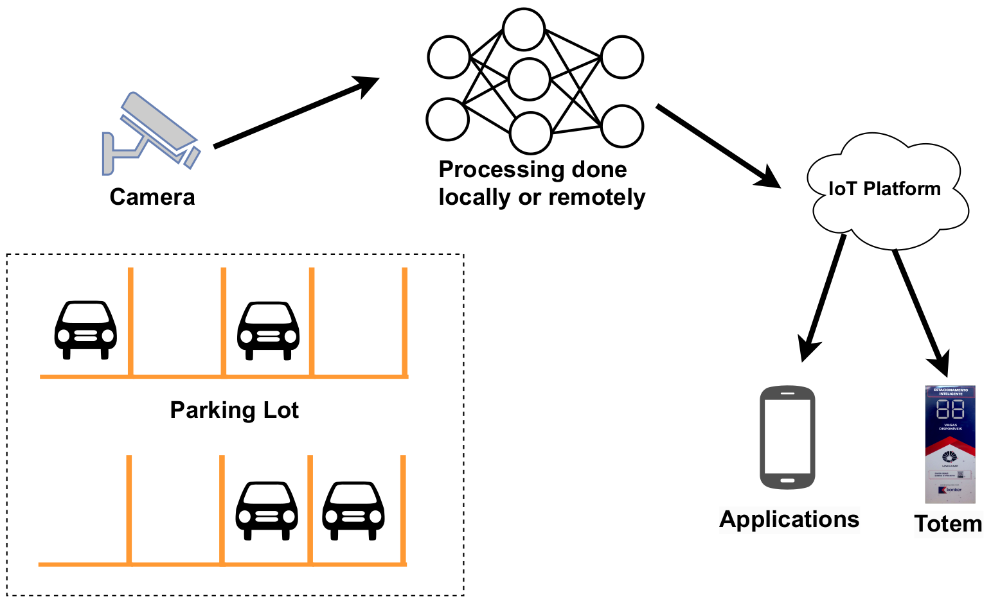
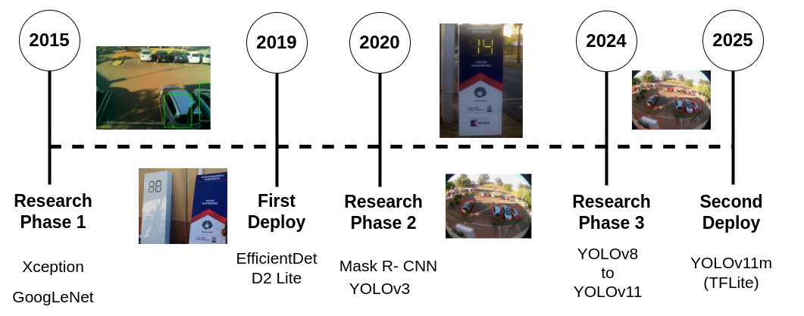
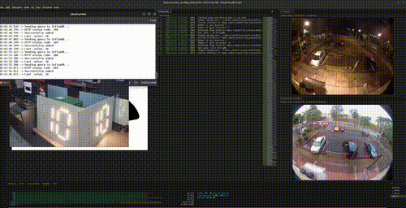

# Smart Parking System with Deep Learning at Unicamp

This repository contains the complete implementation of a real-time smart parking monitoring system using edge computing and deep learning, representing a decade of research iterations at Unicamp.

### Architecture:

### Timeline:

### Real Time Demonstration Video:

[Full video link](https://youtu.be/7rofjEfX5fA)

---

## 🛠 Hardware Setup
For complete hardware instructions go to 
[📖 Hardware Documentation](hardware/)

Key components:
- [Parking totem assembly](hardware/totem/)
- [Raspberry Pi 3B+ configuration](hardware/pi_and_camera/)

---

## 💻 Software Implementation
For detailed software documentation go to 
[📖 Software Documentation](software/)

Key components:
- A benchmark of different deep learning models for accuracy and inference time
- [Instructions to set and monitor InfluxDB](software/influx/)

---

