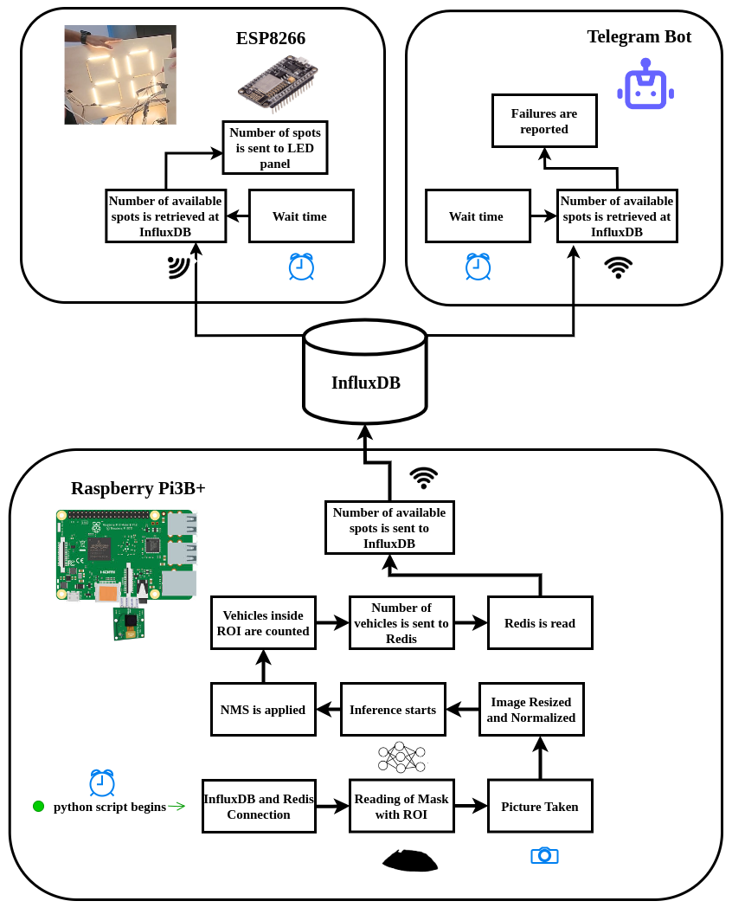
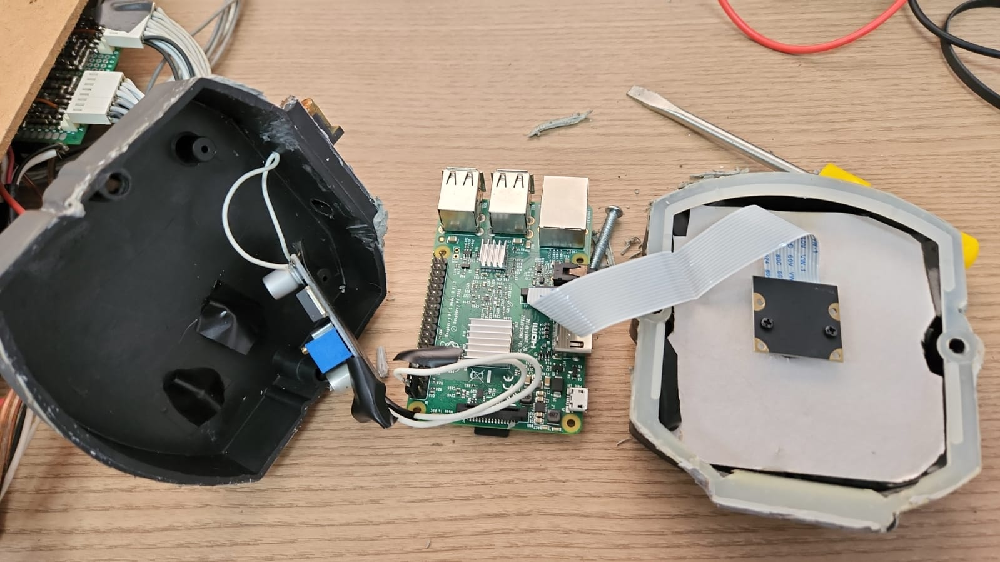

# 🚗 Raspberry Pi Parking Spot Detection  

## 📌 Overview  
This project sets up a **Raspberry Pi 3+B** with a camera module to **detect parked cars** and log the number of available parking spots in an **InfluxDB** database. The system runs continuously and restarts automatically after reboots.

## 🏗️ System Architecture
The following flowchart explains how data moves through the system: 

This documentation covers the part that takes place inside the Raspberry Pi

📌 Data Flow Overview:

- The Raspberry Pi Camera Module captures an image.

- The YOLOv11m (TFLite) model processes the image and detects vehicles.

- The system applies a mask to focus on the parking area.

- The count of occupied and available spots is stored temporarily in Redis.

- The results are sent to the InfluxDB cloud instance for long-term storage.


## 🏗️ Hardware & OS  
- **Hardware:**  
  - Raspberry Pi 3+B  
  - Raspberry Pi Camera Module (connected via CSI port)  
  - **Power Supply:** 5V 3A recommended.  
  - If you don't have a 5V power adapter, you can use a **voltage regulator** (e.g., **LM2596**) to step down a higher voltage (e.g., 12V) to 5V.
  - Protective case 
- **Operating System:** Debian GNU/Linux 12 (Bookworm) (32-bit)  

## 🔧 Features  
- Runs **YOLOv11m (TFLite)** for car detection  
- Logs **parking availability** in **InfluxDB** (cloud-hosted)  
- Uses **Redis** for temporary storage  
- **Supervisor** ensures the script runs at boot and auto-restarts  
- **Tailscale** for remote SSH access  
- **Cronjob** for periodic reboots  

## 📸 System Setup  

### Required Files  
Before running the system, ensure you have the following files:  
- **Mask File**: `mask_original_img_768_1024_bw.png` Defines the regions of interest for detection.  
- **YOLOv11m (TFLite) Model**: The model used for car detection.  
  - 📥 **Download `yolo11m_float16.tflite` Pre-Trained model from our Google Drive Folder**: [Link](https://drive.google.com/drive/folders/1D_88IY0JBwUdi3EKsSAzLj1hxN6SJGit?usp=sharing)  
- **InfluxDB Instance**: The system requires an active **InfluxDB** instance in the cloud. More information at [Setting Influx Section](../../software/influx/)

---

---

## ⚙️ Installation  

### 📦 Install Dependencies  
It is recommended to use a **Python virtual environment** to keep dependencies isolated:  

#### **Create and Activate Virtual Environment**
```sh
python3 -m venv ~/parking_venv
source ~/parking_venv/bin/activate
```
#### **Install Required Python Packagest**

```sh
pip install -r requirements.txt
```
#### **Swap Configuration**

We had to increase Swap for a more stable environment.
We had 1GB of RAM, and set Swap to 1024MB (1GB).

To also do that, edit the swap configuration file:

```sh
sudo nano /etc/dphys-swapfile
```

Find the line:
```sh
CONF_SWAPSIZE=100
```
(or any other existing value) and change it to:

```sh
CONF_SWAPSIZE=1024
```

Save and exit (CTRL+X → Y → ENTER) and reboot the Pi.

#### **🔑 Configure InfluxDB Access**
Save your InfluxDB API token in a file:

```sh
echo "your_influxdb_write_token" > /home/pi/token_write.txt
```
Modify the script’s connection settings for InfluxDB and Redis as needed.

#### **🛠️ Setting Up Supervisor**
Supervisor ensures that the script runs at boot and restarts if it crashes.

Install Supervisor
```sh
sudo apt update && sudo apt install supervisor -y
```

Configure Supervisor
Navigate to the Supervisor directory and Create a configuration file:
```sh
cd /etc/supervisor
sudo nano /etc/supervisor/supervisord.conf
```

Add the following lines if they don't exist:
```sh
[supervisord]
nodaemon=true
```

Create a conf.d Directory
```sh
sudo mkdir -p /etc/supervisor/conf.d
```

Inside conf.d, create a new configuration file for our script:

```sh
sudo nano /etc/supervisor/conf.d/influx_parking.conf
```

Paste the following:

```sh
[program:parking_inference]
command=/home/pi/parking_venv/bin/python3 /home/pi/parking_2024/demo_influx_photo_inference.py
autostart=true
autorestart=true
stderr_logfile=/var/log/parking_inference.err.log
stdout_logfile=/var/log/parking_inference.out.log
```

Save the file and apply changes:

```sh
sudo supervisorctl reread
sudo supervisorctl update
sudo systemctl restart supervisord
```

#### **🛑 Managing Supervisor**

Check status:

```sh
sudo supervisorctl status
```

Stop script:

```sh
sudo supervisorctl stop parking_inference
```

Restart script:

```sh
sudo supervisorctl start parking_inference
```

Restart Supervisor after updating the script:

```sh
sudo systemctl restart supervisord
sudo supervisorctl reread
sudo supervisorctl update
```

#### **🛑🔄 Auto Reboot Setup**

To reboot the Raspberry Pi every 6 hours, edit the crontab:

```sh
crontab -e
```

At the end of the file, add:

```sh
@reboot sleep 21600 && sudo reboot

```
(Change 21600 to a different value for a different interval.)

#### **▶️ Running the Script Manually**

Before running, ensure the script is executable:
```sh
chmod +x /home/pi/parking_2024/demo_influx_photo_inference.py
```

To run manually:

```sh
source ~/parking_venv/bin/activate
python3 /home/pi/parking_2024/demo_influx_photo_inference.py
```
#### **▶️ 📄 Log Management**

Check logs if there are issues:

```sh
tail -f /var/log/parking_inference.out.log
tail -f /var/log/parking_inference.err.log
```


#### **📦 Raspberry Pi Case**
Once the setup is complete, place the Raspberry Pi and Camera Module inside a protective case to ensure stability and protection.



Lastly, install it on the desired place that covers the parking lot.


