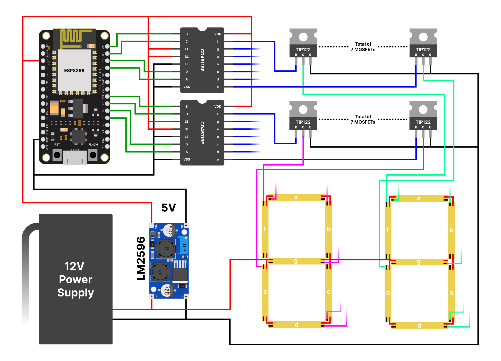
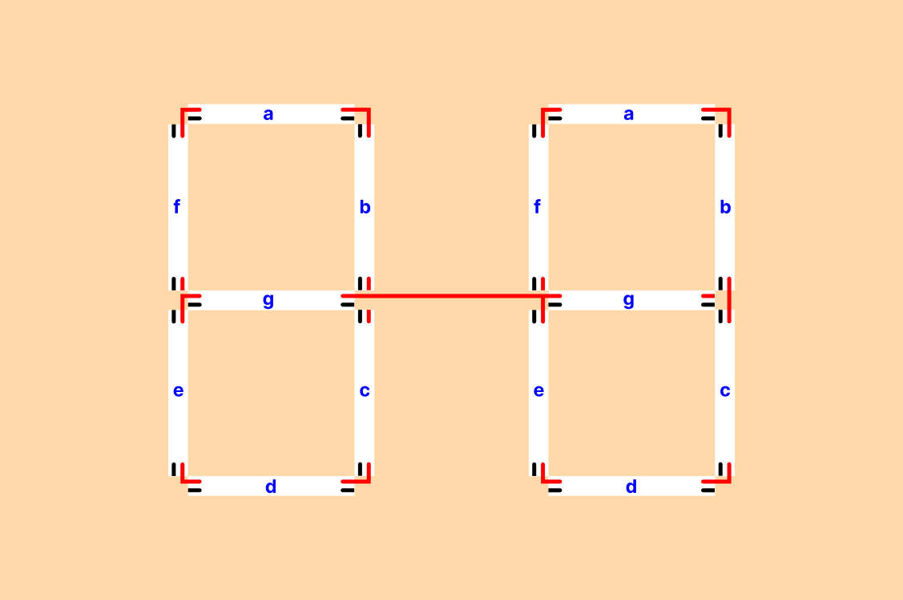
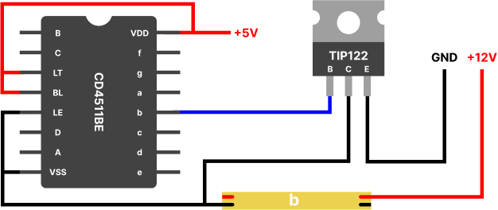

# Parking Availability Totem - Hardware Implementation

## Circuit Overview

The totem features two LED panels (front and back) displaying real-time parking availability. The system operates as follows:

1. **Microcontroller**: ESP8266 retrieves parking data from InfluxDB every minute
2. **Display**: Shows available spaces on two 2-digit 7-segment panels
3. **Power**: 12V input regulated to 5V for logic components

## Key Components
| Component | Specification | Qty |
|-----------|---------------|-----|
| Voltage Regulator | LM2596 (12V→5V) | 1 |
| Multiplexer | CD4511BE | 2 |
| MOSFET | TIP122 | 14 |
| LED Panel | 2-digit 7-segment (Common Anode) | 2 |

## Installation Guide

We will first focus on constructing the individual components, then we will connect everything up and program the microcontroller.

### 1. Assembling the board

Since the totem would be installed outdoors, its important we make sure the base of the display is resistant as we 
want it to last as long as possible. A wooden board was chosen large enough to fit 2 digits with a decent size.
We then cut 14 segments of equal length from the LED strip, and fixated them with their own glue on the board, as shown 
in the following illustration.

### 2. Wiring the LED strip

The positive terminal of each segment was connected together using solid core wires of appropriate thickness, allowing all segments to be easily linked to the positive side of the 12V power supply. One ground copper pad from each segment was soldered to another piece of wire, which will then be connected to its respective MOSFET.

We made small holes on the board so the wires could be hidden on the back, for organization and aesthetics purposes.

### 3. Assembling the circuits

Let's start by taking a closer look at the multiplexer and MOSFET. The CD4511BE is a multiplexer designed to decode its 4-pin digital inputs into segments signals. Because it is controlled by the ESP8266 microcontroller, the decoder runs at 5V and its also not made to drive high currents, so in order to actually control the leds, each of the 7 decoder outputs are connected to other 7 MOSFETs. The MOSFETs themselves have their base connected to one decoder output, the emitter is connected to ground and the collector is connected to the ground wire of its respective led strip segment.
Bellow is a diagram illustrating how each segment is controlled. 

Because the largest number displayed is 16, we needed two 7-segment displays, requiring two multiplexers and 14 MOSFETs.

### 4. Connecting everything up

To conclude the circuit, we need to connect the ESP8266 microcontroller, a power supply and the voltage regulator. 
Because the LED strip runs at 12V, we need a power supply with that voltage that can also provide enough current for all the segments. The required current depends greatly on the chosen strip and its power consumption. The ESP8266 development board runs at 5V, as does the multiplexer, so we are using an LM2596 voltage regulator to power them.
Finally, to control the multiplexer, we connect its four remaining input pins to four I/O pins on the ESP8266. The specific pins used don’t matter.

> Note that because we decided to build two panels, the entire section containing the segments and MOSFETs was duplicated, resulting in a total of 28 of each. That also means that each output pin from the multiplexer is connected to two different MOSFETs, one from each panel.

### 5. Programming the ESP8266

We used the PlatformIO framework because it provides a streamlined development environment, simplifies dependency management, and offers better integration with the ESP8266 compared to the Arduino IDE. The code used and the description on how it works can be found on the [ESP8266 folder](./esp8266/README.md)

### 6. Done!

If everything was done correctly, the panels will start working just by turning on the power supply.